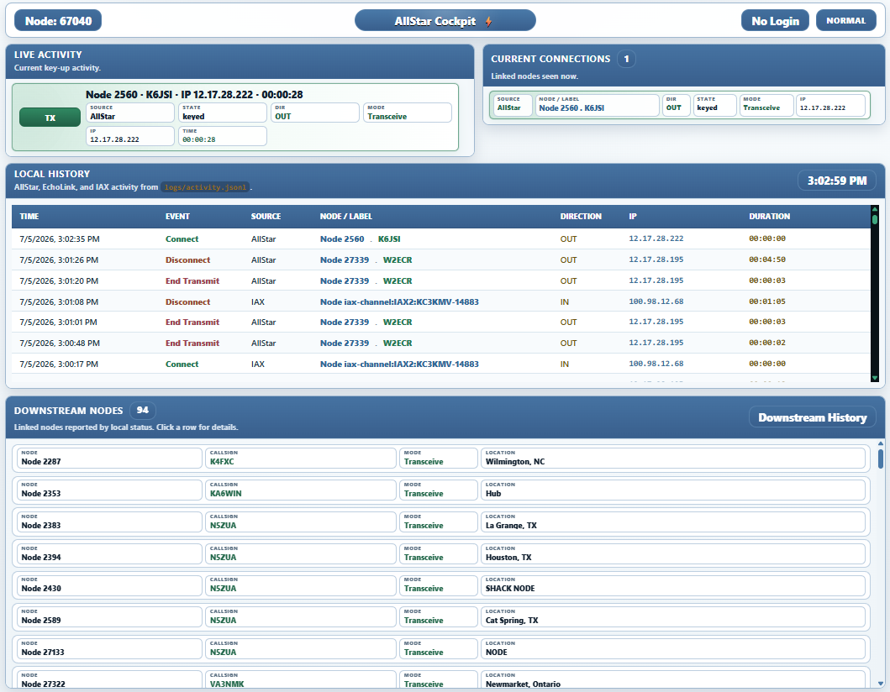

# AllStar Cockpit

AllStar Cockpit is a lightweight web dashboard for one ASL3 / AllStarLink node.

It is designed to watch what the node is doing, not control it. The dashboard reads Asterisk/app_rpt status, shows current AllStarLink/EchoLink/IAX activity, keeps local activity history, and shows downstream nodes that may be connected behind the node or network you are linked to.

Current development version: **0.1.94-dev**

<p align="center">
  <a href="screenshot.png">
    
  </a>
</p>

<p align="center">
  <em>AllStar Cockpit dashboard with Live Activity, Current Connections, Local History, and Downstream History.</em>
</p>

## Installation

Repo:

```text
https://github.com/TerryClaiborne/allstar_cockpit
```

Use this only for a brand-new install:

```bash
cd /var/www/html
sudo git clone https://github.com/TerryClaiborne/allstar_cockpit.git allstar_cockpit
cd allstar_cockpit
sudo ./setup_allstar_cockpit.sh
```

After setup, edit `config.ini` and set your local AllStar node:

```bash
sudo nano /var/www/html/allstar_cockpit/config.ini
```

At minimum, change:

```ini
MYNODE="YOUR_ALLSTAR_NODE"
```

Example:

```ini
MYNODE="67040"
```

Then open:

```text
https://YOUR_NODE_HOSTNAME/allstar_cockpit/public/
```

or locally:

```text
https://127.0.0.1/allstar_cockpit/public/
```

## Updating

### Normal code update

For most updates:

```bash
cd /var/www/html/allstar_cockpit
git pull origin main
```

### Update that needs setup

Run setup after pulling when the update includes installer changes, permissions, sudoers, Apache security, logrotate, or other system-level changes:

```bash
cd /var/www/html/allstar_cockpit
git pull origin main
sudo ./setup_allstar_cockpit.sh
```

Normal setup/update runs are designed to preserve:

- `config.ini`
- auth settings and password hash
- local logs and history
- runtime JSON files
- cache files
- local machine data

## What it does

- Shows the configured local node at the top of the page.
- Shows current key-up activity in **Live Activity**.
- Shows currently linked AllStar, EchoLink, and IAX clients/channels in **Current Connections**.
- Records local activity in **Local History**.
- Shows linked nodes behind the current connection in **Downstream Nodes**.
- Records downstream changes in **Downstream History**.
- Hides private/local bridge nodes when configured.
- Optionally uses AllStarLink remote stats lookups to improve downstream visibility.
- Provides optional login mode for protected actions.

## What it does not do

- It does not connect or disconnect nodes.
- It does not restart Asterisk or DVSwitch services.
- It does not edit Asterisk, DVSwitch, or AllStar configuration.
- It does not replace AllTune2, AllScan, AllMon, or DVSwitch Cockpit.

## How it works

The browser loads `public/index.php`. JavaScript polls `api/status.php`. That API uses the read-only helper in `bin/allstar-cockpit-read.sh` and `bin/allstar-cockpit-ami-status.php` to read Asterisk status.

The app writes project-local runtime files only under the AllStar Cockpit directory:

```text
logs/activity.jsonl              Local AllStar/EchoLink/IAX activity history
logs/downstream-history.jsonl    Downstream-node history
logs/error.log                   PHP/application error log when enabled by PHP/Apache
run/current_snapshot.json        Last local connection snapshot
run/downstream-current.json      Last downstream snapshot used for seen/gone tracking
data/cache/                      Node lookup and remote stats cache
```

These runtime files are local machine data. They should not be committed to the public repo.

## Dashboard overview

AllStar Cockpit is organized around four main views:

- **Live Activity** shows current key-up activity.
- **Current Connections** shows active AllStar, EchoLink, and IAX links/channels.
- **Local History** shows recent local connect, transmit-end, and disconnect events.
- **Downstream Nodes / Downstream History** shows nodes reported behind the current connection when that information is available.

Rows can be clicked for details when extra node, callsign, IP, direction, or mode information is available.

## AllStar, EchoLink, and IAX notes

### AllStar

AllStar nodes can usually be linked to AllStarLink Stats and QRZ when a callsign is known.

### EchoLink

EchoLink node numbers are not the same thing as AllStarLink node numbers. EchoLink entries should not be linked as if they were AllStar nodes.

EchoLink IP/details may be limited depending on what Asterisk exposes.

### IAX

AllStar Cockpit currently recognizes common local IAX patterns including:

- `iaxrpt`,
- `iax-client`,
- `allstar-public`,
- named phone-style IAX clients.

IAX rows are shown as local/current client activity, not downstream nodes.

## Configuration file policy

The live config file is:

```text
/var/www/html/allstar_cockpit/config.ini
```

The repo example file is:

```text
/var/www/html/allstar_cockpit/config.ini.example
```

Rules:

- `config.ini` is local only.
- `config.ini` must not be committed to the public repo.
- Updates must preserve existing `config.ini`.
- Updates must preserve logs, run files, cache, history, and auth settings.
- Fresh installs may create `config.ini` from `config.ini.example` only when `config.ini` does not already exist.

## config.ini options

The parser accepts both `KEY="value"` and `KEY = "value"`. Project examples use no spaces around equals.

Most users only need to set:

```ini
MYNODE="YOUR_ALLSTAR_NODE"
```

If you have private/local bridge nodes you do not want shown in the dashboard, also set:

```ini
HIDE_NODES="1957"
```

### Main settings

- `APP_NAME` — Display name used by the dashboard. Default: `"AllStar Cockpit"`.
- `MYNODE` — Your local AllStar node number. This is the main required setting. Default: `"YOUR_ALLSTAR_NODE"`.
- `HIDE_NODES` — Comma- or space-separated private/local nodes to hide from the dashboard. Default: `""`.

### Login / security

- `ALLSTAR_COCKPIT_AUTH_ENABLED` — Enables login for protected actions. `0` = No Login / Normal. `1` = Login enabled. Default: `0`.
- `ALLSTAR_COCKPIT_ADMIN_USER` — Login username when auth is enabled. Default: `"admin"`.
- `ALLSTAR_COCKPIT_ADMIN_PASSWORD_HASH` — Stored password hash. Default: `""`.

Set or change the admin password with:

```bash
sudo /var/www/html/allstar_cockpit/setup_allstar_cockpit.sh --set-admin-password
```

Do not type a plain password directly into `config.ini`.

### Asterisk / helper

- `ASTERISK_BIN` — Path to the Asterisk CLI binary. Default: `"/usr/sbin/asterisk"`.
- `USE_SUDO_HELPER` — Makes the web app use the read-only sudo helper. The setup script installs the needed sudoers rule. Default: `0`.
- `HELPER_PATH` — Path to the read-only helper script. Default: `"/var/www/html/allstar_cockpit/bin/allstar-cockpit-read.sh"`.

### Dashboard refresh / history

- `POLL_INTERVAL_SECONDS` — Browser refresh interval. Keep this at `1` unless troubleshooting. Default: `1`.
- `FAST_STATUS_ONLY` — Uses the faster AMI-based status path plus required read-only checks. Set to `0` only when troubleshooting fallback reads. Default: `1`.
- `HISTORY_LIMIT` — Default local history limit for history API reads. Default: `250`.

### Display / lookups

- `SHOW_OBSERVED_IPS` — Shows IP addresses when Asterisk exposes them. Set to `0` to hide observed IPs. Default: `1`.
- `ENABLE_EXTERNAL_LOOKUPS` — Enables remote AllStarLink stats lookups to improve downstream visibility. Requires internet access from the node. Default: `0`.
- `EXTERNAL_LOOKUP_CACHE_SECONDS` — Cache time for remote stats lookups. Default: `60`.
- `REMOTE_DOWNSTREAM_LOOKUP_DEPTH` — Recursive downstream lookup depth. Default: `2`.
- `REMOTE_DOWNSTREAM_LOOKUP_LIMIT` — Maximum remote nodes followed per lookup pass. Default: `12`.
- `NODE_CACHE_TTL_SECONDS` — Cache lifetime for node lookup data. Default: `86400`.
- `CACHE_DIR` — Project-local cache directory. Default: `"/var/www/html/allstar_cockpit/data/cache"`.

### Downstream filtering / history

- `HIDE_PRIVATE_NODE_RANGE` — Hides AllStar-style private nodes in the `1000-1999` range. Default: `1`.
- `VALID_DOWNSTREAM_ONLY` — Filters noisy downstream values so only useful public-style node numbers show. Default: `1`.
- `SHOW_ECHOLINK_DOWNSTREAM` — Allows EchoLink-style `3xxxxxx` numbers in downstream lists. Leave this off unless testing. Direct EchoLink connections still show in Current Connections and Local History. Default: `0`.
- `DOWNSTREAM_HISTORY_RETENTION_HOURS` — How long Downstream History is kept. Default: `48`.
- `DOWNSTREAM_GONE_MISSES` — Number of missed polls before a downstream node is logged as gone. Default: `3`.

### Local project paths

Most users should not need to change these.

- `DATA_DIR` — Default: `"/var/www/html/allstar_cockpit/data"`.
- `LOGS_DIR` — Default: `"/var/www/html/allstar_cockpit/logs"`.
- `RUN_DIR` — Default: `"/var/www/html/allstar_cockpit/run"`.
- `ACTIVITY_LOG` — Default: `"/var/www/html/allstar_cockpit/logs/activity.jsonl"`.
- `ERROR_LOG` — Default: `"/var/www/html/allstar_cockpit/logs/error.log"`.
- `SNAPSHOT_FILE` — Default: `"/var/www/html/allstar_cockpit/run/current_snapshot.json"`.
- `DOWNSTREAM_HISTORY_LOG` — Default: `"/var/www/html/allstar_cockpit/logs/downstream-history.jsonl"`.
- `DOWNSTREAM_CURRENT_FILE` — Default: `"/var/www/html/allstar_cockpit/run/downstream-current.json"`.

## Optional login

AllStar Cockpit is read-only by design. It does not connect, disconnect, restart, or control the node.

For that reason, web login is optional and is disabled by default. In the default **No Login / Normal** mode, the dashboard can be viewed normally.

Login support is included mainly for future protected features and for users who prefer to place even read-only status pages behind a password.

Enable login and set/change the admin password:

```bash
sudo /var/www/html/allstar_cockpit/setup_allstar_cockpit.sh --set-admin-password
```

Disable login and keep the saved password hash:

```bash
sudo /var/www/html/allstar_cockpit/setup_allstar_cockpit.sh --disable-auth
```

Header labels:

```text
No Login / Normal   auth disabled
View Only / Login   auth enabled, not signed in
Signed In / Logout  auth enabled, signed in
```

Current protected action:

- Clear Downstream History.

Read-only viewing remains available. Normal setup/update runs preserve the existing auth setting and saved password hash.


## Useful checks

Check the dashboard API:

```bash
curl -k -sS https://127.0.0.1/allstar_cockpit/api/status.php | python3 -m json.tool | head -80
```

Check Asterisk IAX channels manually:

```bash
sudo /usr/sbin/asterisk -rx "iax2 show channels"
sudo /usr/sbin/asterisk -rx "core show channels concise" | grep -i IAX2
```

Check EchoLink DB lookup manually:

```bash
sudo /usr/sbin/asterisk -rx "echolink dbget nodename 490982"
```

Check PHP syntax:

```bash
find /var/www/html/allstar_cockpit -name '*.php' -print -exec php -l {} \;
```

## Repo safety checklist

Before publishing or committing:

```text
NEVER commit:
- config.ini
- logs/*.jsonl
- logs/*.log
- run/*.json
- data/cache/*
- backups
- local tarballs/zips
- private node/user data
```

The repo should keep only examples/placeholders such as:

```text
config.ini.example
data/node_cache.json.example
data/.gitkeep
logs/.gitkeep
run/.gitkeep
```
